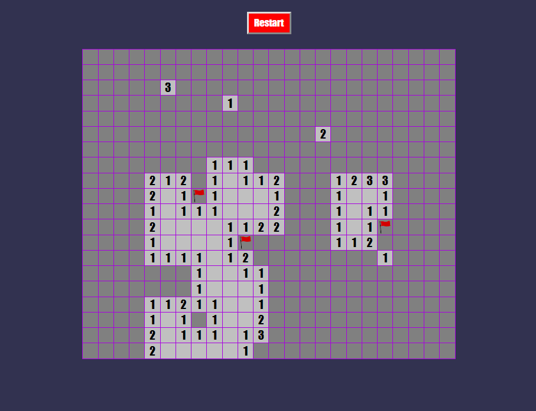

This project was bootstrapped with [Create React App](https://github.com/facebook/create-react-app).



## Installing dependencies

```bash
yarn
```

## Starting the application

```bash
yarn start
```

Open [http://localhost:3000](http://localhost:3000) to view the application in a browser.

The page will reload if you make edits.  
You will also see any lint errors in the console.

## Building the application

```bash
yarn build
```

`yarn build` creates a folder called `build`.  

It correctly bundles React in production mode and optimizes the build for the best performance.
The build is minified and the filenames include the hashes.
